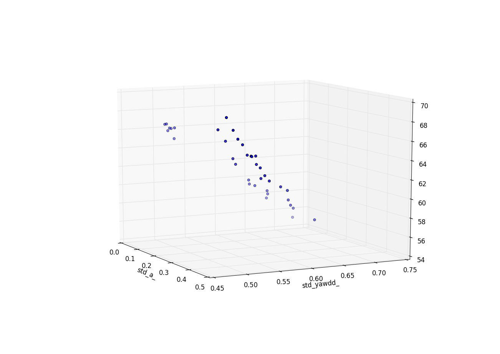

# Unscented Kalman Filter Project
Self-Driving Car Engineer Nanodegree Program

---

## Project Description
The project "unscented Kalman filter" is based on the same structure as the extended Kalman filter.
It uses a main file that calls a function called ProcessMeasurement. Anything important happens in this function. The function is part of the class ukf.

## Goal
- The overall processing chain (prediction, laser update or radar update depending on measurement type) must be correct.
- The student is not allowed to use values from the future to reason about the current state.
- It must be possible to run the project in three different modes: considering laser only, with considering radar only, or with using both sensors.
- For every mode, the overall RMSE (2d position only) may not be more than 10% increased to what the original solution is able to reach (this number depends on the individual measurement sequence)
- The RMSE of laser AND radar must be lower than radar only or laser only
- The NIS of radar measurements must be between 0.35 and 7.81 in at least 80% of all radar update steps.

## Visualization


## Achieving RMSE and NIS values

The following parameters were tuned using a grid-search method:

	- process noise
		- std_a		
		- std_yawdd

These values are provided by equipment manufacturers:
	- laser measurement noise
		- std_laspx = 0.15
		- std_laspy = 0.15
	- radar measurement noise
		- std_radr = 0.3
		- std_radphi = 0.03
		- std_radrd = 0.3

The grid search method iterates through ranges of values and evaluates performance for each set of values.

It gathers the following metrics at each step:

	- rmse_px
	- rmse_py
	- rmse_vx
	- rmse_vy
	- nis_percentage (% of measurements with 0.35 > NIS < 7.81)
	- nis_lidar (breakdown)
	- nis_radar (breakdown)

[Here is sample output from grid-search output.](data/gridsearch_fragment.txt)

### Analysis

- Use fixed values of laser and radar noise provided by manufacturer.
- Vary process noise (std-a and std-yawdd) in grid search
- Tabulate grid search results and sort them (in Excel) by RMSE to pick best process noise values.
- Plot process noise (std-a and sts-yawdd) against NIS values in a 3D plot.

Pandas dataframes and pyplot are used in plot.py to 3D-plot:
X-axis: std-a, Y-axis: std_yawdd and Z-axis: NIS %.


## Results
After studying the data sets and grid search results, I obtained the following results:

### Lowest RMSE

- Process noise
	- std_a = 0.09
	- std_yawdd = 0.7


Data | PX | PY | VX | VY
--- | --- | --- | --- | ---
"sample 1" | 0.0610262 | 0.0703744 | 0.55841 | 0.554423
"sample 2" | 0.188741 | 0.189771 | 0.541626 | 0.526248

** NIS:** Radar NIS is low on average: between 0.35 and 7.81 in only 44% of cases

### Good NIS

- Process noise
	- std_a = 0.438
	- std_yawdd = 0.488

Data | PX | PY | VX | VY
--- | --- | --- | --- | ---
"sample 1" | 0.0853967 | 0.0898704 | 0.604129 | 0.587199
"sample 2" | 0.185043 | 0.189281 | 0.548535 | 0.465349

** NIS:** Radar NIS between 0.35 and 7.81 in 69% of measurements

## Command line to run grid search
```
./UnscentedKF gridsearch ../data/good_values.txt ../data/sample-laser-radar-measurement-data-2.txt 0.2 0.55 ../data/sample-laser-radar-measurement-data-1.txt 0.09 0.65
```
## Dependencies

* cmake >= v3.5
* make >= v4.1
* gcc/g++ >= v5.4

## Basic Build Instructions

1. Clone this repo.
2. Make a build directory: `mkdir build && cd build`
3. Compile: `cmake .. && make`
4. Run it: `./UnscentedKF path/to/input.txt path/to/output.txt`. You can find
   some sample inputs in 'data/'.
    - eg. `./UnscentedKF ../data/sample-laser-radar-measurement-data-1.txt output.txt`
